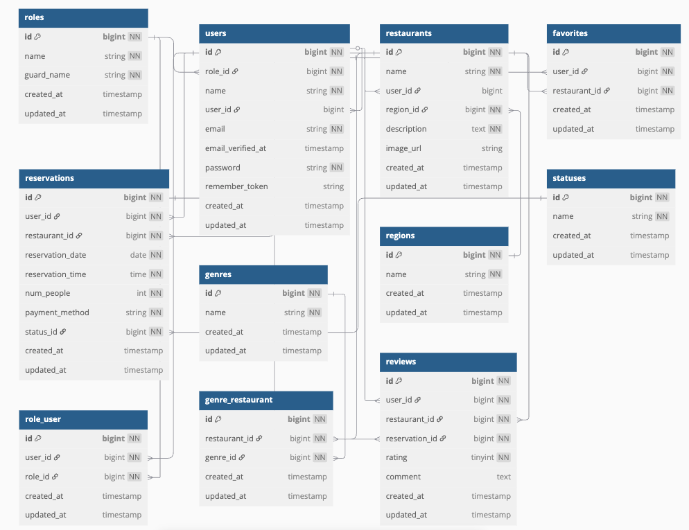

# gourmet-app-test

## 作成した目的
外部の飲食店予約サービスは手数料を取られるので自社で予約サービスを持ちたいため。

## 環境構築
1. Dockerを起動する
2. プロジェクト直下で以下のコマンドを実行する

```
make init
```
## メール認証
mailtrapというツールを使用しています。<br>
以下のリンクから会員登録をしてください。<br>
https://mailtrap.io/

.envファイルのMAIL_MAILERからMAIL_ENCRYPTIONまでの項目をコピー＆ペーストしてください。<br>
MAIL_FROM_ADDRESSは任意のメールアドレスを入力してください。

## Stripeについて
現金支払いとカード支払いのオプションがありますが、カード支払いを選択すると、マイページの該当の予約に決済画面に遷移するボタンがあります。<br>
それをクリックするとStripe決済画面に遷移しカード情報を入力すると決済が成功する想定です。<br>

また、StripeのAPIキーは以下のように設定をお願いいたします。
```
STRIPE_PUBLIC_KEY="パブリックキー"
STRIPE_SECRET_KEY="シークレットキー"
```

以下のリンクは公式ドキュメントです。<br>
https://docs.stripe.com/payments/checkout?locale=ja-JP


## 使用技術（実行環境）
- Laravel 11.44.2
- MySQL 10.11.11 (データベース)
- Nginx 1.27.3(Web サーバー)
- PHP 8.2.28 (PHP 実行環境)
- Docker (開発環境のコンテナ管理)

## テーブル設計
### roleテーブル
| カラム名       | 型               | PRIMARY KEY | UNIQUE KEY | NOT NULL | FOREIGN KEY |
|------------|-----------------|-------------|------------|----------|-------------|
| id         | unsigned bigint | ○           |            | ○        |             |
| name       | sring           |             |            | ○        |             |
| guard_name | string          |             |            | ○        |             |
| created_at | timestamp       |             |            |          |             |
| updated_at | timestamp       |             |            |          |             |

### usersテーブル
| カラム名              | 型               | PRIMARY KEY | UNIQUE KEY | NOT NULL | FOREIGN KEY |
|-------------------|-----------------|-------------|------------|----------|-------------|
| id                | unsigned bigint | ○           |            | ○        |             |
| role_id           | unsigned bigint |             |            | ○        | roles(id)   |
| name              | string          |             |            | ○        |             |
| user_id           | unsigned bigint |             |            |          | users(id)   |
| email             | string          |             | ○          | ○        |             |
| email_verified_at | timestamp       |             |            |          |             |
| password          | string          |             |            | ○        |             |
| remember_token    | string          |             |            |          |             |
| created_at        | timestamp       |             |            |          |             |
| updated_at        | timestamp       |             |            |          |             |


### restaurantsテーブル
| カラム名        | 型               | PRIMARY KEY | UNIQUE KEY | NOT NULL | FOREIGN KEY |
|-------------|-----------------|-------------|------------|----------|-------------|
| id          | unsigned bigint | ○           |            | ○        |             |
| name        | string          |             |            | ○        |             |
| user_id     | unsigned bigint |             |            |          | users(id)   |
| region_id   | unsigned bigint |             |            | ○        | regions(id) |
| description | text            |             |            | ○        |             |
| image_url   | string          |             |            |          |             |
| created_at  | timestamp       |             |            |          |             |
| updated_at  | timestamp       |             |            |          |             |

### favoritesテーブル
| カラム名          | 型               | PRIMARY KEY | UNIQUE KEY | NOT NULL | FOREIGN KEY     |
|---------------|-----------------|-------------|------------|----------|-----------------|
| id            | unsigned bigint | ○           |            | ○        |                 |
| user_id       | unsigned bigint |             |            | ○        | users(id)       |
| restaurant_id | unsigned bigint |             |            | ○        | restaurants(id) |
| created_at    | timestamp       |             |            |          |                 |
| updated_at    | timestamp       |             |            |          |                 |

### reservationsテーブル
| カラム名             | 型               | PRIMARY KEY | UNIQUE KEY | NOT NULL | FOREIGN KEY     |
|------------------|-----------------|-------------|------------|----------|-----------------|
| id               | unsigned bigint | ○           |            | ○        |                 |
| user_id          | unsigned bigint |             |            | ○        | users(id)       |
| restaurant_id    | unsigned bigint |             |            | ○        | restaurants(id) |
| reservation_date | date            |             |            | ○        |                 |
| reservation_time | time            |             |            | ○        |                 |
| num_people       | integer         |             |            | ○        |                 |
| payment_method   | string          |             |            | ○        |                 |
| status_id        | unsigned bigint |             |            | ○        | statuses(id)    |
| created_at       | timestamp       |             |            |          |                 |
| updated_at       | timestamp       |             |            |          |                 |


### genresテーブル
| カラム名       | 型               | PRIMARY KEY | UNIQUE KEY | NOT NULL | FOREIGN KEY |
|------------|-----------------|-------------|------------|----------|-------------|
| id         | unsigned bigint | ○           |            | ○        |             |
| name       | string          |             |            | ○        |             |
| created_at | timestamp       |             |            |          |             |
| updated_at | timestamp       |             |            |          |             |

### regionsテーブル
| カラム名       | 型               | PRIMARY KEY | UNIQUE KEY | NOT NULL | FOREIGN KEY |
|------------|-----------------|-------------|------------|----------|-------------|
| id         | unsigned bigint | ○           |            | ○        |             |
| name       | string          |             |            | ○        |             |
| created_at | timestamp       |             |            |          |             |
| updated_at | timestamp       |             |            |          |             |

### statusesテーブル
| カラム名       | 型               | PRIMARY KEY | UNIQUE KEY | NOT NULL | FOREIGN KEY |
|------------|-----------------|-------------|------------|----------|-------------|
| id         | unsigned bigint | ○           |            | ○        |             |
| name       | string          |             |            | ○        |             |
| created_at | timestamp       |             |            |          |             |
| updated_at | timestamp       |             |            |          |             |

### role_userテーブル
| カラム名       | 型               | PRIMARY KEY | UNIQUE KEY | NOT NULL | FOREIGN KEY |
|------------|-----------------|-------------|------------|----------|-------------|
| id         | unsigned bigint | ○           |            | ○        |             |
| user_id    | unsigned bigint |             |            | ○        | users(id)   |
| role_id    | unsigned bigint |             |            | ○        | roles(id)   |
| created_at | timestamp       |             |            |          |             |
| updated_at | timestamp       |             |            |          |             |

### genre_userテーブル
| カラム名          | 型               | PRIMARY KEY | UNIQUE KEY | NOT NULL | FOREIGN KEY     |
|---------------|-----------------|-------------|------------|----------|-----------------|
| id            | unsigned bigint | ○           |            | ○        |                 |
| restaurant_id | unsigned bigint |             |            | ○        | restaurants(id) |
| genre_id      | unsigned bigint |             |            | ○        | genres(id)      |
| created_at    | timestamp       |             |            |          |                 |
| updated_at    | timestamp       |             |            |          |                 |

### reviewsテーブル
| カラム名           | 型               | PRIMARY KEY | UNIQUE KEY | NOT NULL | FOREIGN KEY      |
|----------------|-----------------|-------------|------------|----------|------------------|
| id             | unsigned bigint | ○           |            | ○        |                  |
| user_id        | unsigned bigint |             |            | ○        | users(id)        |
| restaurant_id  | unsigned bigint |             |            | ○        | restaurants(id)  |
| reservation_id | unsigned bigint |             |            | ○        | reservations(id) |
| rating         | tinyInteger     |             |            | ○        |                  |
| comment        | text            |             |            |          |                  |
| created_at     | timestamp       |             |            |          |                  |
| updated_at     | timestamp       |             |            |          |                  |


## ER図



## URL
- 開発環境: http://localhost:81

## AWS
- URL: https://github.com/tetutora/gourmet-app-AWS/tree/feature/AWS
